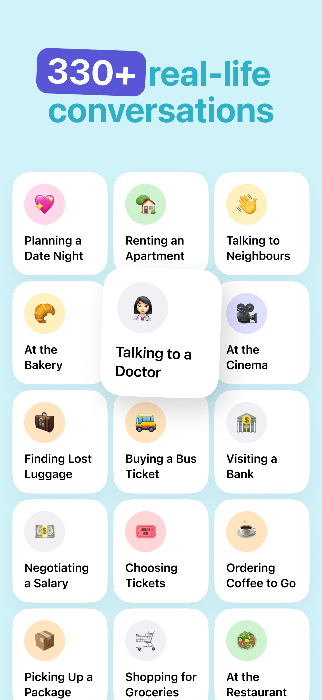
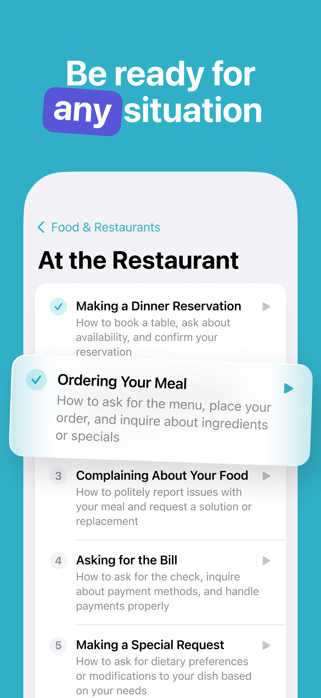
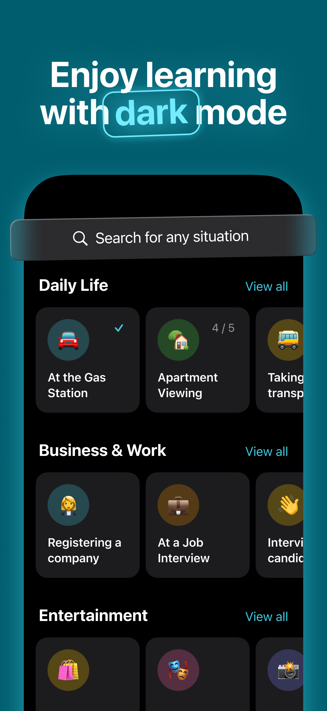

# DailyDialogs

DailyDialogs is an iOS app designed to help users master English through real-life conversations. Whether you're preparing for job interviews, apartment hunting, doctor visits, or ordering food, DailyDialogs provides natural, practical dialogues for everyday situations.

## Features

- **500+ Real-life Dialogues**: Access a vast library covering 100+ everyday situations
- **AI-Generated Custom Dialogues**: Get personalized conversations for unique scenarios
- **Multiple Difficulty Levels**: Choose between Beginner, Intermediate, or Advanced
- **Contextual Dictionary**: Learn situation-specific vocabulary and phrases
- **Bookmarking System**: Save favorite dialogues and terms for quick access
- **Dark Mode Support**: Comfortable learning experience in any lighting condition

## Screenshots

    
    
    
    
    

## Support

### Report Issues
Found a bug? Visit our [GitHub Issues page](https://github.com/daily-dialogs/dialogs/issues/new?template=bug_report.md) to report technical problems.

### Feature Requests
Have ideas for improvements? Create a new issue with the ["enhancement" label](https://github.com/daily-dialogs/dialogs/issues/new?template=feature_request.md&labels=enhancement) on our GitHub.

### General Support
For general questions, [open a support request](https://github.com/daily-dialogs/dialogs/issues/new?template=support_request.md) and we'll respond within 24-48 hours.

## License

© 2025 DailyDialogs. All rights reserved.
